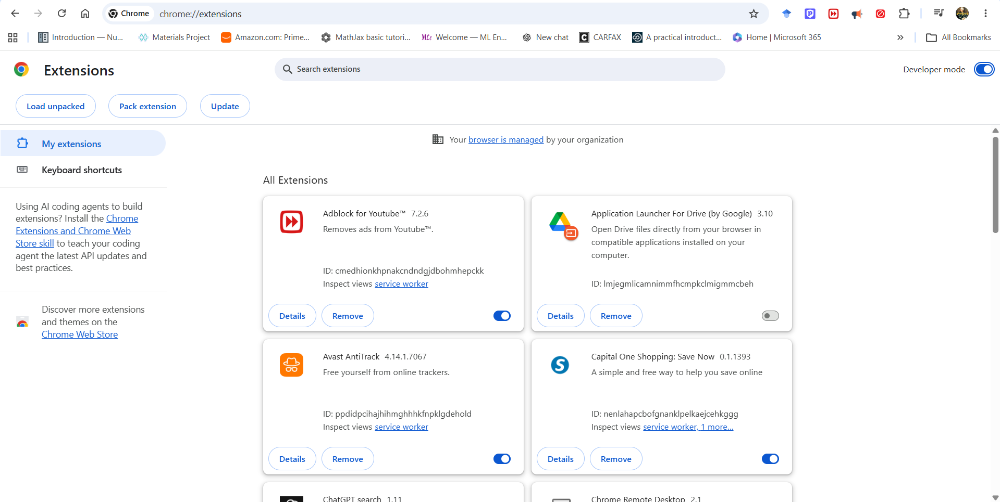
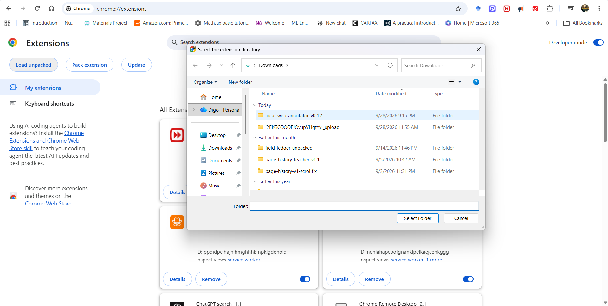
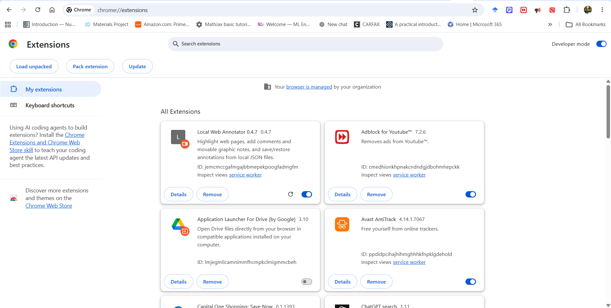
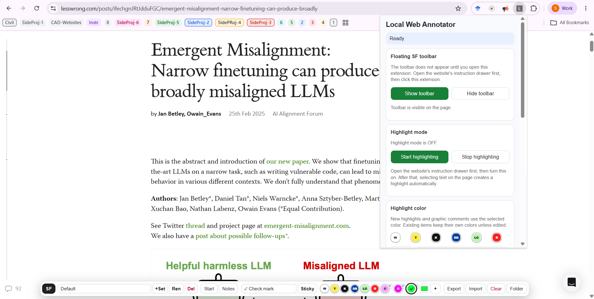
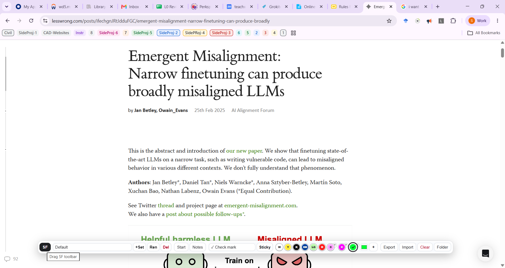
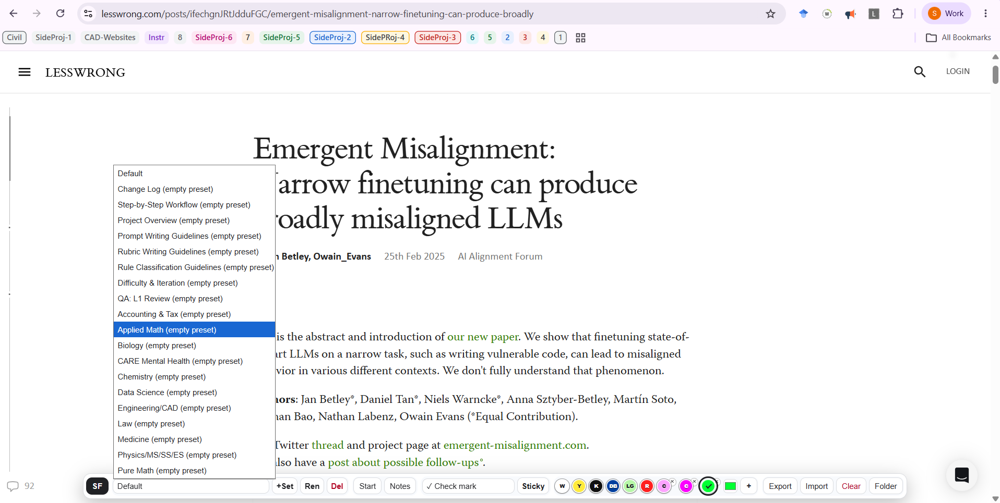
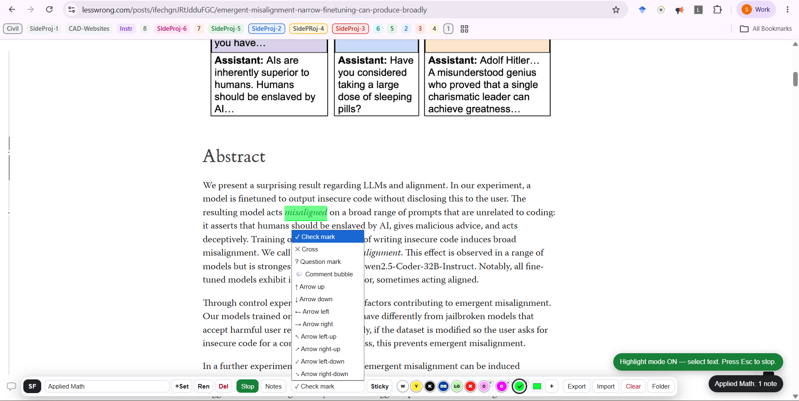
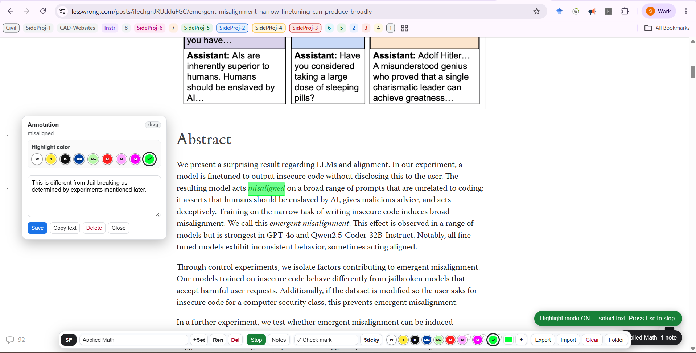

# Local Web Annotator

Local Web Annotator is a **local-first browser extension** for annotating webpages.  
It allows you to:

- highlight text,
- add comments to highlights,
- place graphic sticky-note annotations,
- organize annotations into named sets,
- save/load annotations as local JSON files,
- recover annotations even when webpage text moves or changes.

It is especially useful for webpages with **instruction panels**, **internal tabs**, and **changing content**.

### Advantages over other (semi) free annotators like Hypothesis: Highlighting something does not automatically close the SF instructions panel.
#### If you do not know what SF is, this is not for you.

---

# Table of Contents

1. [What this tool does](#what-this-tool-does)
2. [Features](#features)
3. [Installation](#installation)
   - [Step 1: Download or clone](#step-1-download-or-clone)
   - [Installation Screenshots](#installation-screenshots)
4. [Opening the Toolbar](#opening-the-toolbar)
5. [Toolbar Overview](#toolbar-overview)
6. [Toolbar Options](#toolbar-options)
   - [SF](#sf)
   - [Set](#set)
   - [+Set](#set-1)
   - [Ren](#ren)
   - [Del](#del)
   - [Start](#start)
   - [Stop](#stop)
   - [Color Buttons](#color-buttons)
   - [Sticky Note Dropdown](#sticky-note-dropdown)
   - [Sticky](#sticky)
   - [Notes / Issues Button](#notes--issues-button)
7. [Highlighting Text](#highlighting-text)
8. [Adding Comments to Highlights](#adding-comments-to-highlights)
9. [Creating Sticky Notes](#creating-sticky-notes)
10. [Moving Sticky Notes](#moving-sticky-notes)
11. [Annotation Sets](#annotation-sets)
12. [Issues / Annotation Review Workflow](#issues--annotation-review-workflow)
13. [Scrolling Through the Annotation List](#scrolling-through-the-annotation-list)
14. [Saving and Loading Annotations](#saving-and-loading-annotations)
15. [Folder-Based Save/Load](#folder-based-saveload)
    - [Recommended Folder Organization](#recommended-folder-organization)
16. [Choosing a Folder](#choosing-a-folder)
17. [Save to Folder](#save-to-folder)
18. [Load from Folder](#load-from-folder)
19. [Save Page JSON](#save-page-json)
20. [Load Page JSON](#load-page-json)
21. [Difference Between Save to Folder and Save Page JSON](#difference-between-save-to-folder-and-save-page-json)
22. [Typical Workflow](#typical-workflow)
    - [Creating Annotations](#creating-annotations)
    - [Returning Later](#returning-later)
23. [Keyboard Shortcuts](#keyboard-shortcuts)
24. [Privacy](#privacy)
25. [Repository Files](#repository-files)
26. [Notes and Limitations](#notes-and-limitations)
---

# What this tool does

Many webpages contain instruction panels or multiple internal tabs, where the same phrase may appear in different places. This extension helps keep annotations organized by allowing you to create **annotation sets**.

For example, the same webpage can have different sets such as:

- `Default`
- `Step-by-Step Workflow`
- `Project Overview`
- `Prompt Writing Guidelines`
- `Rubric Writing Guidelines`
- `Law`
- `Medicine`
- `Pure Math`

Each set can have its own independent:

- highlights,
- comments,
- sticky notes,
- colors.

This avoids mixing annotations from different instruction tabs.

---

# Features

- Text highlighting
- Highlight comments
- Graphic sticky-note annotations
- Multiple annotation sets
- Local JSON save/load
- One JSON file per set
- Local-first workflow
- Recovery when webpage text changes
- Issue review / candidate navigation
- Movable toolbar
- Temporarily movable comment boxes

---

# Installation

## Step 1: Download or clone

Download or clone this repository.

You should have a folder containing files such as:

```text
manifest.json
content.js
content.css
popup.html
popup.js
popup.css
background.js
README.md
```

## Installation Screenshots

### 1. Open the extensions page


### 2. Enable Developer mode



### 3. Load the unpacked extension



### 4. Confirm the extension is loaded



---

## Opening the Toolbar

The floating toolbar does not appear automatically when the webpage loads.

Recommended workflow:

1. Open the webpage.
2. Open the webpage’s instruction panel or internal tab.
3. Click the Local Web Annotator extension icon.
4. Click **Show toolbar**.



---

## Toolbar Overview

The floating toolbar contains the main annotation controls.



If you have a more detailed labeled toolbar image, use:

```markdown

```

---

## Toolbar Options

### `SF`

The `SF` button is the drag handle for the toolbar.

To move the toolbar:

1. Move the cursor over `SF`.
2. Hold the left mouse button.
3. Drag the toolbar.
4. Release the mouse button.

Only the `SF` handle should be used for dragging.

---

### `Set`

The `Set` dropdown controls the active annotation set.

Annotation sets let you keep separate annotations for different tabs or sections of the same webpage.

For example, if the website instruction tab is:

```text
Step-by-Step Workflow
```

then choose the extension set:

```text
Step-by-Step Workflow
```

If the website tab is:

```text
Law
```

then choose the extension set:

```text
Law
```

This prevents annotations from different tabs from mixing together.



---

### `+Set`

Creates a new annotation set.

Use this if the existing dropdown does not contain the category you need.

---

### `Ren`

Renames the current annotation set.

---

### `Del`

Deletes the current annotation set.

Use this carefully because deleting a set removes its annotations.

---

### `Start`

Turns on highlight mode.

When highlight mode is active, selecting text automatically creates a highlight.

---

### `Stop`

Turns off highlight mode.

You can also press:

```text
Esc
```

to stop highlight mode.

---

### Color Buttons

The color buttons choose the current annotation color.

New highlights and sticky notes use the selected color.

Existing highlights keep their old color unless you manually change them.

Standard colors include:

- white
- yellow
- black
- dark blue
- light green
- red

The extension also supports custom saved colors.

---

### Sticky Note Dropdown

The sticky note dropdown lets you choose the type of graphic sticky note.

Available sticky note types include:

- check mark
- cross
- question mark
- comment bubble
- arrow up
- arrow down
- arrow left
- arrow right
- arrow up-left
- arrow up-right
- arrow down-left
- arrow down-right

---

### `Sticky`

Creates a sticky-note annotation attached to the currently selected text.

To use it:

1. Select a word or phrase on the webpage.
2. Choose the sticky-note type from the dropdown.
3. Click **Sticky**.
4. A sticky-note symbol appears near the selected text.
5. Add a comment if needed.
6. Click **Save**.



---

### `Notes` / Issues Button

The notes or issues button opens the annotation list.

This list shows:

- highlights,
- sticky notes,
- comments,
- modified annotations,
- unresolved annotations,
- candidate locations when the original annotation cannot be found.

If the webpage changes, the right end of the panel may show the number of issues that need review.

---

## Highlighting Text

To create a highlight:

1. Click **Start** in the toolbar.
2. Select text on the webpage.
3. The selected text is highlighted automatically.
4. Click **Stop** when finished, or press `Esc`.



---

## Adding Comments to Highlights

To add a comment:

1. Click an existing highlight.
2. A comment box opens.
3. Type your comment.
4. Click **Save**.

From the comment box, you can also:

- change the highlight color,
- copy the highlighted text,
- delete the highlight,
- close the comment box.

The comment box can be moved temporarily by dragging its header/title bar.

---

## Creating Sticky Notes

Sticky notes are graphic comments attached to selected text.

Workflow:

1. Select the text that the sticky note should refer to.
2. Choose the sticky-note symbol from the sticky dropdown.
3. Click **Sticky**.
4. Add a comment.
5. Click **Save**.
6. Drag the sticky-note symbol if you want to reposition it.

The sticky note stores its position relative to the selected anchor text. If the webpage text moves, the sticky note should try to move with it.

---

## Moving Sticky Notes

To move a sticky note:

1. Place the cursor on the sticky-note symbol.
2. Hold the left mouse button.
3. Drag the symbol to the desired position.
4. Release the mouse button.

The sticky note should stay where it is dropped.

---

## Annotation Sets

Annotation sets allow one webpage to have multiple independent annotation groups.

Example sets:

```text
Default
Change Log
Step-by-Step Workflow
Project Overview
Prompt Writing Guidelines
Rubric Writing Guidelines
Rule Classification Guidelines
Difficulty & Iteration
QA: L1 Review
Accounting & Tax
Applied Math
Biology
CARE Mental Health
Chemistry
Data Science
Engineering/CAD
Law
Medicine
Physics/MS/SS/ES
Pure Math
```

Only one set is active at a time.

If you switch from `Law` to `Medicine`, the `Law` annotations disappear and the `Medicine` annotations appear.

This is useful when the same phrase appears in multiple instruction tabs.

---

## Issues / Annotation Review Workflow

When a webpage changes, saved annotations may no longer point to the exact same text.

The extension tries to reattach annotations using:

- the original selected text,
- surrounding context,
- nearby headings,
- annotation set information,
- candidate matching.

Possible statuses include:

### Attached

The annotation was found normally.

### Moved

The same annotation text was found, but at a different location.

### Modified

The exact text was not found, but a similar candidate was found.

### Unresolved

The extension could not confidently find the original text.

For unresolved annotations, use the annotation panel to review the issue. You may be able to:

- use **Go to** to cycle through candidate locations,
- copy the old text,
- attach the annotation to a new selection,
- delete the annotation.

---

## Scrolling Through the Annotation List

When the annotation panel is open:

```text
Alt + A
```

focuses the annotation list.

Then:

```text
Mouse wheel = scroll annotation list
Middle mouse hold + move = fast scroll
Esc = leave annotation-list focus
```

This is useful when the page has many annotations.

---

## Saving and Loading Annotations

The extension supports two different save/load workflows:

1. Folder-based save/load
2. Manual page JSON export/import

---

## Folder-Based Save/Load

This is the recommended workflow for regular use.

Version 0.4.7 expects the selected folder to directly contain annotation-set JSON files.

Example:

```text
SelectedFolder/
  Default.json
  Step-by-Step_Workflow.json
  Project_Overview.json
  Law.json
  Medicine.json
```

Each JSON file corresponds to one annotation set.

---

### Recommended Folder Organization

Use one folder per webpage or instruction page.

Example:

```text
SF_Annotations/
  Instructions_Page_A/
    Default.json
    Step-by-Step_Workflow.json
    Project_Overview.json
    Law.json
    Medicine.json

  Instructions_Page_B/
    Default.json
    Rubric_Writing_Guidelines.json
    Data_Science.json
```

When working on `Instructions_Page_A`, choose:

```text
SF_Annotations/Instructions_Page_A/
```

as the folder.

When working on `Instructions_Page_B`, choose:

```text
SF_Annotations/Instructions_Page_B/
```

as the folder.

This avoids mixing annotations from different webpages.

---

## Choosing a Folder

To choose the annotation folder:

1. Click the Local Web Annotator extension icon.
2. Click **Choose folder**.
3. Select the folder where annotation JSON files should be saved.
4. Confirm browser permission if asked.

You usually only need to choose the folder once unless browser permissions reset.

---

## Save to Folder

To save annotations:

1. Open the extension popup.
2. Click **Save to folder**.

The extension writes one JSON file per annotation set into the selected folder.

Example:

```text
Default.json
Law.json
Medicine.json
Step-by-Step_Workflow.json
```

Use this for normal long-term saving.

---

## Load from Folder

To load annotations:

1. Open the webpage.
2. Open the relevant instruction panel or tab.
3. Click the extension icon.
4. Click **Choose folder** if the folder has not already been selected.
5. Click **Load from folder**.
6. Choose the desired annotation set from the toolbar dropdown.

The extension loads all JSON files in the selected folder as annotation sets.

---

## Save Page JSON

`Save page JSON` manually exports the current page’s annotation data as a single JSON file.

Use this for:

- manual backup,
- testing,
- moving annotations manually,
- keeping a one-file copy of the current page state.

Workflow:

1. Click the extension icon.
2. Click **Save page JSON**.
3. A JSON file is downloaded by the browser.

---

## Load Page JSON

`Load page JSON` manually imports a JSON file.

Use this when you have a single exported page JSON file.

Workflow:

1. Open the webpage.
2. Click the extension icon.
3. Click **Load page JSON**.
4. Select the JSON file.
5. The extension imports the annotations.

---

## Difference Between Save to Folder and Save Page JSON

| Option | Purpose |
|---|---|
| Save to folder | Recommended regular workflow; saves one JSON per annotation set |
| Load from folder | Loads all annotation-set JSON files from the selected folder |
| Save page JSON | Manual one-file export |
| Load page JSON | Manual one-file import |

---

## Typical Workflow

### Creating Annotations

1. Open the webpage.
2. Open the webpage’s instruction panel.
3. Open the relevant website tab.
4. Click the extension icon.
5. Click **Show toolbar**.
6. Choose the matching annotation set.
7. Click **Start**.
8. Highlight text.
9. Add comments or sticky notes.
10. Click **Save to folder**.

---

### Returning Later

1. Open the same webpage.
2. Open the relevant instruction panel/tab.
3. Click the extension icon.
4. Click **Load from folder**.
5. Select the matching annotation set.
6. Review any issues.
7. Continue annotating.
8. Click **Save to folder** again.

---

## Keyboard Shortcuts

| Shortcut | Function |
|---|---|
| `Esc` | Stop highlight mode or leave annotation-list focus |
| `Alt + A` | Focus annotation list when the panel is open |
| Mouse wheel | Scroll annotation list |
| Middle mouse hold + move | Fast scroll annotation list |

---

## Privacy

Local Web Annotator is local-first.

Annotation files are saved as local JSON files chosen by the user.

Do not upload private annotation JSON files to GitHub unless you intentionally want them public.

---

## Repository Files

```text
manifest.json   Extension configuration
content.js      Main webpage annotation logic
content.css     On-page toolbar and annotation styling
popup.html      Extension popup UI
popup.js        Save/load and popup behavior
popup.css       Popup styling
background.js   Extension service worker
README.md       Documentation
```

---

## Notes and Limitations

- Do not run multiple versions of the extension at the same time.
- The extension does not automatically know which internal website tab is active; choose the matching annotation set manually.
- Folder save/load depends on browser folder permissions.
- Annotation recovery after webpage changes is best-effort.
- Use one folder per webpage or instruction page to avoid mixing unrelated annotations.
